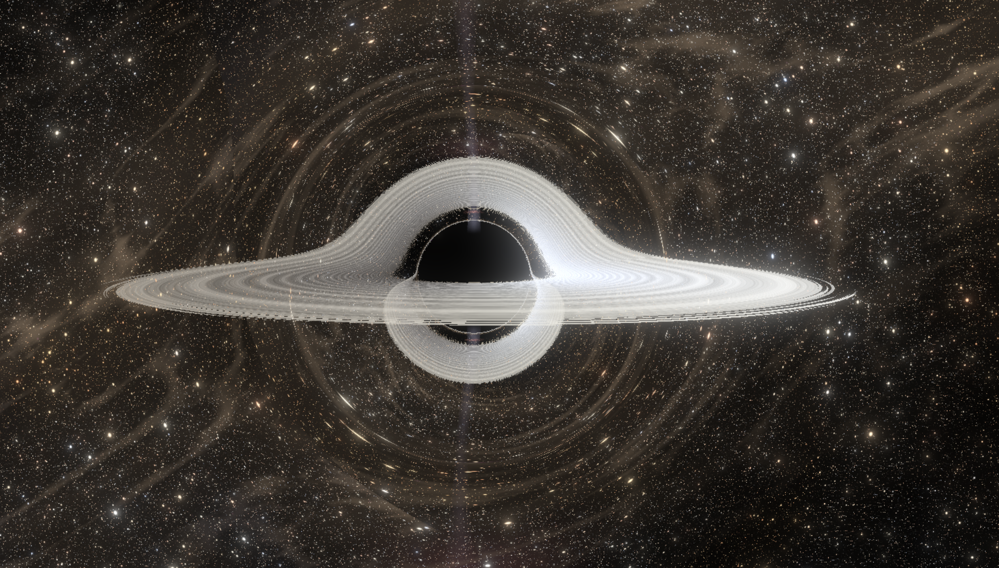

# Black Hole Simulation

A real-time, GPU-raytraced **Schwarzschild black hole** rendered in raw WebGL2,
with relativistic accretion disk, plasma jets, gravitational lensing of a
procedural starfield, HDR bloom, and an interactive feature toggle panel. No engines, no
wrappers — every pixel is a hand-rolled fragment-shader geodesic.

🌌 **Live demo:** https://fizgrad.github.io/BlackHoleSimulation/



## Features

### Physics
- **Schwarzschild geodesic raymarching**, integrating the impact-parameter
  null-geodesic ODE `d²u/dφ² = −u + (3/2)·rs·u²` with RK4 in fixed angular
  steps. The ray is followed for ~2 full revolutions so secondary lensed
  images of the disk are captured.
- **Multiple equatorial-plane crossings** are composited front-to-back, so
  the iconic *Interstellar* "disk arched over the horizon" image emerges
  naturally from the geometry instead of being faked.
- **Relativistic Doppler beaming** on the accretion disk: the side rotating
  toward the camera is brighter and bluer, the receding side dimmer and
  redder.
- **Gravitational redshift** dimming and reddening near the photon sphere.
- **Doppler asymmetry on the jets** — bulk-flow Lorentz factor of γ ≈ 2.5
  makes the approaching jet up to ~10× brighter than the receding one.

### Visuals
- **Accretion disk** with FBM turbulence, Keplerian differential rotation,
  noise-warped inner/outer edges, ISCO plunging wisps, photon-ring boost,
  and a Gargantua-style amber/orange palette tipped with hot blue-white
  near ISCO.
- **Relativistic jets** along the rotation axis with kink-instability axis
  wobble, limb-brightened tube profile, periodic plasma knots, a
  termination shock at the far end, Kelvin-Helmholtz boundary instabilities,
  and spectral-aging colour gradient (blue-white → magenta → deep red).
- **Detailed Milky-Way-like background**: noise-warped centerline,
  variable thickness, asymmetric bulge, "Great Rift" dust lane offset
  from the band centerline, Sagittarius-style star clouds, procedural
  pink HII regions.
- **7 distant galaxies** (spiral / elliptical / starburst / barred), each
  with logarithmic spiral arms, dust lanes, HII knots, and bulge.
- **6 nebulae**, **4 layers of stars**, **globular clusters**, and
  **selective dust reddening** so stars behind dust lanes appear redder,
  not just dimmer.

### Pipeline
- HDR scene rendered to an `RGBA16F` floating-point FBO.
- 5-mip **bright-pass downsample** chain (Call-of-Duty Advanced Warfare
  bloom) into shrinking float render targets.
- 5-mip **tent-filter additive upsample** chain for soft, energy-preserving
  glow.
- Final composite pass: scene + bloom → hue-preserving Reinhard tonemap →
  sRGB gamma.
- FPS / frame-time counter (top-right).

## Stack

- WebGL2, accessed directly via `canvas.getContext('webgl2')`. **No
  Three.js / Babylon.js / regl.**
- Vite + TypeScript (strict).
- npm.

## Running locally

```bash
npm install
npm run dev      # Vite dev server with HMR (shaders hot-reload via ?raw)
npm run build    # production build to dist/
npm run preview  # serve the built bundle
npx tsc --noEmit # typecheck
```

GPU requirement: WebGL2 + `EXT_color_buffer_float` (essentially every
modern browser/GPU).

## Controls

| Action | Effect |
|---|---|
| Drag | Orbit camera around the black hole |
| Wheel | Zoom in/out |

## Project layout

```
src/
  main.ts                       # canvas + GL context + render loop + bloom
  gl/
    program.ts                  # shader compile/link with annotated errors
    quad.ts                     # fullscreen-triangle VAO
    fbo.ts                      # HDR float render targets
  scene/
    camera.ts                   # orbit camera + basis vectors
  shaders/
    fullscreen.vert             # passthrough vertex shader (clip space)
    blackhole.frag              # the heart: geodesic raymarcher + disk + jets + sky
    bloom_downsample.frag       # CoD-AW 13-tap downsample with bright-pass
    bloom_upsample.frag         # 3×3 tent-filter additive upsample
    composite.frag              # HDR + bloom → ACES → sRGB
public/                         # (currently empty; cubemap textures could go here)
```

GLSL files are imported as raw strings (`?raw`) so editing them does not
trigger TypeScript rebuilds.

## Notes on the physics shortcuts

- **Schwarzschild only** — no spin (Kerr). The photon ring is still
  approximated with a thin emission shell at `r = 1.5·rs`.
- The disk is a **geometrically thin slab** (one equatorial-plane sample
  per ray crossing) for performance; an earlier branch used full volume
  marching but was too expensive.
- Jets are **emissive volumes** with a phenomenological model — no MHD,
  no synchrotron self-Compton spectrum, just shapes and colours that
  reproduce the observed look.
- Background galaxies/stars are at **infinity** (sampled by the bent
  ray's escape direction); they do not gravitationally lens *each other*.

## License

MIT.
